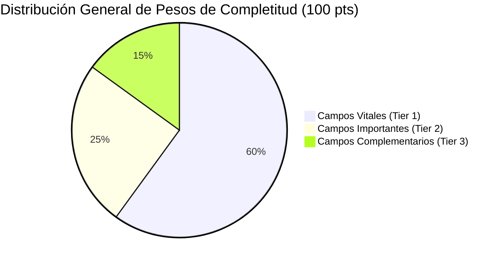

# Especificación de Pesos y Lógica de la Barra de Progreso (Completitud)

Este documento detalla el funcionamiento, la arquitectura y la matriz formal de pesos para calcular la completitud de la ficha de propiedades en Knordica Real Estate. 

La barra de progreso es un elemento de gamificación y control de calidad diseñado para asegurar que las publicaciones del portal tengan el mínimo de información necesaria antes de ser promocionadas.

---

## 1. Reglas Críticas de Bloqueo (0% Progreso)

Una propiedad no tiene sentido lógico ni comercial sin sus datos estructurales primarios. Por lo tanto, se aplican las siguientes **reglas de bloqueo absoluto**:

1. **Sin Operación u Objeto Comercial**: Si el campo `operation` (Venta, Alquiler, Vacacional) está vacío, el progreso es automáticamente **0%**.
2. **Sin Tipo de Inmueble**: Si el campo `property_type` está vacío, el progreso es automáticamente **0%**.
3. **Incompatibilidad Absoluta**: Si la combinación de operación e inmueble es incompatible (ej: Venta de Habitación, o Vacacional de Galpón/Terreno), la barra se desactiva o se fuerza a **0%** indicando un aviso de inconsistencia.

---

## 2. Estructura de Prioridades y Distribución de Pesos

Para que la barra de progreso refleje la utilidad real del anuncio, los campos se agrupan en **tres niveles de prioridad (Tiers)**, sumando un total de 100 puntos posibles:

### Tier 1: Campos Vitales (60% del Peso Total)
Sin estos campos, el anuncio no es apto para publicarse. Ocupan la mayor ponderación:
- **Título en Español (`title_es`)** [15 pts]: La carta de presentación del anuncio.
- **Precio (`price` o `price_per_night`)** [15 pts]: El dato financiero crítico que buscan todos los usuarios.
- **Fotos del Inmueble (`images`)** [15 pts]: Al menos 1 imagen cargada. Las fotos son el factor decisivo de conversión.
- **Ubicación Geográfica (`municipio` + `zone_id` + `lat/lng`)** [15 pts]: Permite la indexación en el mapa y búsquedas por zona.

### Tier 2: Campos Importantes (25% del Peso Total)
Proveen contexto físico fundamental para que el cliente tome una decisión de contacto:
- **Descripción en Español (`description_es`)** [8 pts]: Explicación comercial y detalles únicos del inmueble.
- **Dimensiones (`area_built` y/o `area_total`)** [7 pts]: Tamaño útil y m² construidos.
- **Distribución de Habitáculos (`bedrooms`, `bathrooms`)** [5 pts]: Habitaciones y baños (donde aplique).
- **Año de Construcción y Conservación (`year_built`, `condition`)** [5 pts]: Antigüedad y estado de la estructura.

### Tier 3: Campos Complementarios (15% del Peso Total)
Añaden valor agregado, mejoran la experiencia bilingüe y aumentan el atractivo premium de la publicación:
- **Contenido Bilingüe (`title_en` + `description_en`)** [5 pts]: Traducción al inglés para clientes internacionales.
- **Servicios y Confort (`has_water_tank`, `has_generator`, etc.)** [5 pts]: Planta eléctrica, tanques, internet, aire acondicionado.
- **Seguridad (`has_security_24h`, `has_cctv`, etc.)** [3 pts]: Vigilancia, cámaras, cerco eléctrico.
- **Multimedia (`video_url`, `virtual_tour_url`)** [2 pts]: Videos de YouTube, recorridos 3D.

---

## 3. Matriz de Pesos por Combinación y Justificación

La barra de progreso es dinámica y se adapta a cada una de las tipologías de inmueble. Si un campo no aplica para un tipo (ej: Habitaciones en Terrenos), sus puntos se redistribuyen de forma proporcional hacia los campos vitales del mismo.

A continuación se detalla la matriz de asignación de puntos para las combinaciones del sistema:

| Campo | Residencial (Casa, Apto, Townhouse) | Edificio Comercial / Residencial | Galpón Industrial | Locales / Oficinas | Terrenos / Lotes | Habitaciones / Anexos |
| :--- | :---: | :---: | :---: | :---: | :---: | :---: |
| **`title_es`** | 15 | 15 | 15 | 15 | 15 | 15 |
| **`price`** / **`price_per_night`** | 15 | 15 | 15 | 15 | 15 | 15 |
| **`images`** (al menos 1) | 15 | 15 | 15 | 15 | 15 | 15 |
| **`municipio`** + **`zone_id`** + **`lat/lng`** | 15 | 15 | 15 | 15 | 15 | 15 |
| **`description_es`** | 8 | 8 | 8 | 8 | 10 | 8 |
| **`area_built`** | 4 | 5 | 10 | 5 | 0 (No aplica) | 4 |
| **`area_total`** | 3 | 2 | 2 | 2 | 10 | 3 |
| **`bedrooms`** | 3 | 0 (No aplica) | 0 (No aplica) | 0 (No aplica) | 0 (No aplica) | 3 |
| **`bathrooms`** / **`half_bathrooms`** | 2 | 2 | 5 | 5 | 0 (No aplica) | 2 |
| **`year_built`** / **`condition`** | 5 | 5 | 5 | 5 | 0 (No aplica) | 5 |
| **Traducción Inglés** (`title_en` + `desc_en`) | 5 | 5 | 5 | 5 | 5 | 5 |
| **Servicios y Confort** | 5 | 6 | 5 | 5 | 5 (`has_own_water`) | 5 |
| **Seguridad** | 3 | 5 | 5 | 5 | 5 | 3 |
| **Multimedia** | 2 | 2 | 0 (No aplica) | 0 (No aplica) | 0 (No aplica) | 2 |
| **Cohabitación** (Normas, depósitos) | 0 (No aplica) | 0 (No aplica) | 0 (No aplica) | 0 (No aplica) | 0 (No aplica) | 5 |
| **Suma Total de Puntos** | **100** | **100** | **100** | **100** | **100** | **100** |

---

## 4. Consejos Prácticos para Optimizar la Completitud

- **Completa el Bloque Básico Primero**: Rellenar el título, precio y coordenadas del mapa sumará de golpe el **45%** del progreso.
- **Sube Fotos**: No tener fotos del inmueble bloquea 15 puntos. Aunque la ficha esté llena de texto, no superará el 85% sin al menos una imagen de portada.
- **Idiomas**: La traducción al inglés (`title_en` y `description_en`) aporta 5 puntos. Si no es necesaria, se puede copiar la misma descripción en español para obtener el puntaje completo.
- **Configuración de Servicios**: Rellenar todos los selectores de confort (Generador, Tanque, Internet) añade 5 a 6 puntos importantes.
